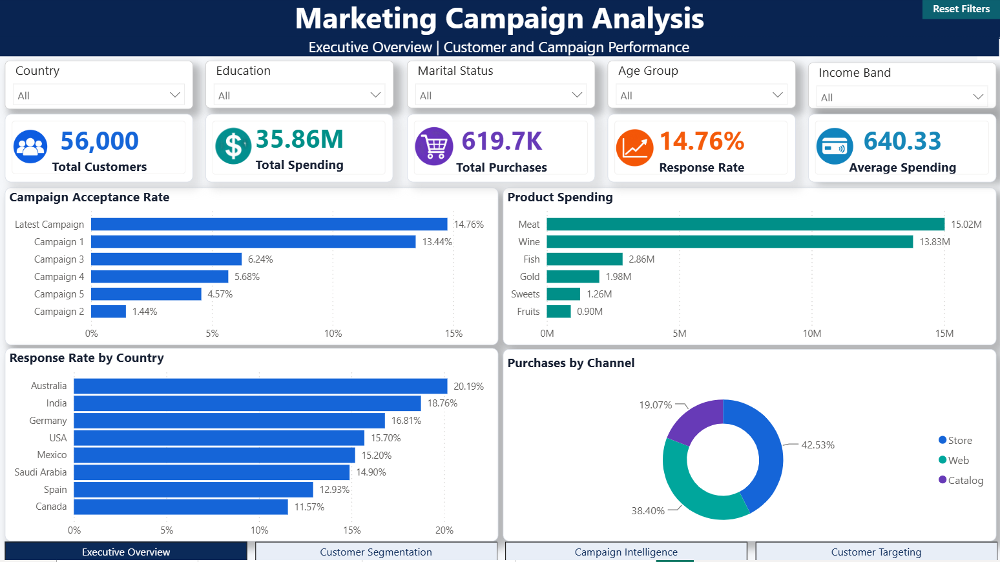
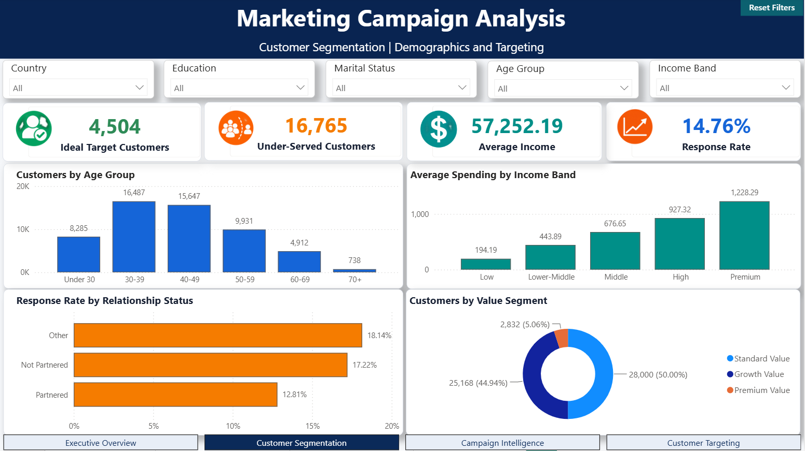
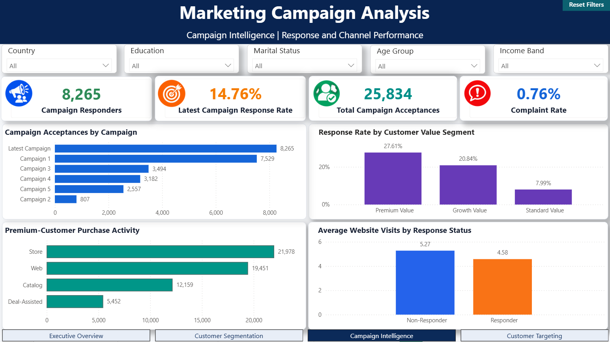
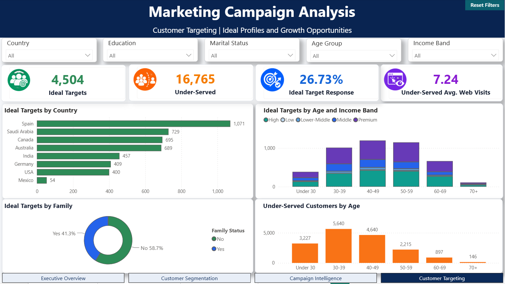

# Marketing Campaign Analysis — Python, MySQL & Power BI

An end-to-end customer and marketing campaign analytics project that transforms raw campaign data into actionable business insights using Python for data preparation and exploratory analysis, MySQL for structured analytics, and Power BI for interactive reporting.

## Project Overview

The project examines customer demographics, purchasing behaviour, product preferences, channel activity, campaign response, complaints, and website engagement. Its purpose is to help the marketing team:

- Measure overall and campaign-level performance.
- Identify high-value customers and profitable purchase channels.
- Understand product and spending patterns.
- Find under-served customer groups.
- Define ideal target-customer profiles.
- Convert analytical findings into practical marketing actions.

## Business Questions

1. What is the overall response rate, and which campaigns perform best?
2. Which products and purchase channels generate the most activity?
3. How do response and spending vary across countries and customer segments?
4. Which demographic and behavioural characteristics describe ideal targets?
5. Which customer groups appear under-served?
6. How does website engagement differ between responders and non-responders?

## Dataset

| File | Purpose |
|---|---|
| `marketing_campaign_data.csv` | Original campaign dataset containing 56,000 customer records and 28 source fields |
| `marketing_data_dictionary.csv` | Definition of the original dataset fields |
| `marketing_campaign_cleaned.csv` | Cleaned and feature-engineered dataset containing 56,000 rows and 58 fields |
| `powerbi_campaign_performance.csv` | Campaign-level fact table for Power BI |
| `powerbi_product_spending.csv` | Customer-product spending fact table for Power BI |
| `powerbi_channel_purchases.csv` | Customer-channel purchase fact table for Power BI |

The data covers demographics, income, household composition, product spending, purchase channels, promotions, web behaviour, complaints, country, and campaign acceptance.

## Technology Stack

- **Python:** Pandas, NumPy, Matplotlib, Seaborn and Jupyter Notebook
- **Database:** MySQL 8.0 and MySQL Workbench
- **Business Intelligence:** Microsoft Power BI Desktop
- **Version Control:** Git and GitHub

## End-to-End Workflow

1. Load the raw campaign data and data dictionary.
2. Inspect structure, data types, missing values, duplicates, and invalid values.
3. Clean and standardize the dataset.
4. Engineer customer, campaign, spending, engagement, and segmentation features.
5. Perform exploratory data analysis in Python.
6. Load the analytical dataset into MySQL.
7. Create KPI, segmentation, product, channel, window-function, and reporting-view queries.
8. Build a relational Power BI model and DAX measures.
9. Design four interactive dashboard pages.
10. Validate filters, navigation, reset buttons, relationships, and refresh behaviour.

## Data Cleaning and Feature Engineering

The notebook documents all cleaning and transformation steps. Major derived fields include:

| Feature group | Examples |
|---|---|
| Customer profile | `Age`, `Age_Group`, `Education_Group`, `Relationship_Status`, `Family_Customer` |
| Household | `Total_Children`, `Has_Children` |
| Value | `Total_Spend`, `Total_Purchases`, `Average_Spend_Per_Purchase`, `Customer_Value_Segment` |
| Engagement | `Customer_Tenure_Days`, `Customer_Tenure_Months`, `High_Web_Engagement`, `Preferred_Channel` |
| Campaign | `Historical_Accepted_Campaigns`, `Total_Accepted_Campaigns`, `Campaign_Responder`, `Campaign_Acceptance_Rate` |
| Targeting | `Ideal_Target_Customer`, `Under_Served_Customer`, `Income_Band`, `Income_Outlier_Flag` |

## MySQL Implementation

The SQL layer contains seven ordered scripts:

| Script | Purpose |
|---|---|
| `01_database_and_schema_setup.sql` | Creates the database and the 58-column `customers` table with keys and validation constraints |
| `02_data_load_and_verification.sql` | Documents the CSV load process and verifies row counts, uniqueness, nulls, ranges, and key totals |
| `03_executive_kpi_queries.sql` | Produces executive KPIs and campaign performance summaries |
| `04_demographic_segmentation_queries.sql` | Analyses age, income, education, relationship, country, and customer segments |
| `05_product_and_channel_queries.sql` | Analyses product spending, purchase channels, promotions, and deal behaviour |
| `06_advanced_window_queries.sql` | Demonstrates ranking and other analytical window functions |
| `07_reporting_views.sql` | Creates reusable reporting views for dashboards and analysis |

The database implementation demonstrates DDL, data loading, aggregate functions, `CASE` expressions, CTEs, `UNION ALL`, window functions, constraints, and reusable views.

## Power BI Data Model

The model follows a simple star-style structure:

- `Customers` is the central customer dimension with one row per customer.
- `Campaign_Performance` contains one row per customer and campaign.
- `Product_Spending` contains one row per customer and product category.
- `Channel_Purchases` contains one row per customer and purchase channel.
- `KPI_Measures` stores the project’s reusable DAX measures.

Each fact table is related to `Customers` through `ID` using an active many-to-one relationship and single-direction filtering.

## Interactive Power BI Dashboard

The report contains four pages with synchronized dropdown slicers for Country, Education, Marital Status, Age Group, and Income Band. It also includes page navigation and Reset Filters buttons.

### 1. Executive Overview



Summarizes total customers, spending, purchases, response rate, average spending, campaign acceptance, product performance, country response, and purchase-channel mix.

### 2. Customer Segmentation



Explores age distribution, income-based spending, relationship-status response, customer value segments, ideal targets, and under-served customers.

### 3. Campaign Intelligence



Compares campaign acceptances, response by customer value, premium-customer channel activity, website visits, complaints, and campaign responders.

### 4. Customer Targeting



Profiles ideal targets by country, age, income, and family status while identifying under-served customers by age group.

## Key Results

| Metric | Result |
|---|---:|
| Total customers | 56,000 |
| Total spending | 35.86M |
| Total purchases | 619.7K |
| Latest campaign response rate | 14.76% |
| Average customer spending | 640.33 |
| Ideal target customers | 4,504 |
| Under-served customers | 16,765 |
| Total campaign acceptances | 25,834 |
| Complaint rate | 0.76% |

Additional findings:

- The latest campaign achieved the highest response rate at **14.76%**, followed by Campaign 1 at **13.44%**.
- Meat and wine dominate product spending at approximately **15.02M** and **13.83M**.
- Store purchases contribute **42.53%** of channel purchases, followed by web at **38.40%** and catalog at **19.07%**.
- Australia has the highest country response rate at **20.19%**, while Canada has the lowest among the analysed countries at **11.57%**.
- Premium-value customers have the strongest response rate at **27.61%**, compared with **7.99%** for standard-value customers.
- Average spending rises steadily with income, from **194.19** in the Low band to **1,228.29** in the Premium band.
- Non-responders average more website visits than responders, indicating that traffic alone does not guarantee conversion.
- The 30–39 and 40–49 age groups contain the largest numbers of customers and under-served opportunities.

## Business Recommendations

1. **Prioritize proven campaign designs:** Reuse the targeting and messaging principles of the latest campaign and Campaign 1, then A/B test them before large-scale rollout.
2. **Protect premium and growth customers:** Create loyalty, early-access, and personalized cross-sell offers for these high-response segments.
3. **Use channel-specific strategies:** Retain stores for high-intent purchases, strengthen personalized web journeys, and use catalog campaigns selectively for suitable segments.
4. **Bundle high-performing products:** Pair meat and wine with lower-spending product categories to improve basket diversity and average order value.
5. **Activate under-served customers:** Focus targeted offers on the 30–49 age range while adapting messages by income, country, and household profile.
6. **Improve web conversion quality:** Study landing pages and checkout friction because non-responders visit the website more often but convert less successfully.

## Project Structure

```text
Marketing-Campaign-Analysis-PowerBI/
├── Dataset/
│   ├── marketing_campaign_data.csv
│   ├── marketing_data_dictionary.csv
│   ├── marketing_campaign_cleaned.csv
│   ├── powerbi_campaign_performance.csv
│   ├── powerbi_product_spending.csv
│   └── powerbi_channel_purchases.csv
├── Images/
│   ├── 01_Executive_Overview.png
│   ├── 02_Customer_Segmentation.png
│   ├── 03_Campaign_Intelligence.png
│   └── 04_Customer_Targeting.png
├── Notebook/
│   └── Marketing_Campaign_Analysis.ipynb
├── PowerBI/
│   └── Marketing_Campaign_Dashboard.pbix
├── Report/
│   ├── Marketing_Campaign_Dashboard.pdf
│   └── Marketing_Campaign_Final_Report.pdf
├── SQL/
│   ├── 01_database_and_schema_setup.sql
│   ├── 02_data_load_and_verification.sql
│   ├── 03_executive_kpi_queries.sql
│   ├── 04_demographic_segmentation_queries.sql
│   ├── 05_product_and_channel_queries.sql
│   ├── 06_advanced_window_queries.sql
│   └── 07_reporting_views.sql
├── .gitignore
├── README.md
└── requirements.txt
```

## How to Run the Project

### 1. Clone the repository

```bash
git clone https://github.com/Ameena-Juhi-99/Marketing-Campaign-Analysis-PowerBI.git
cd Marketing-Campaign-Analysis-PowerBI
```

### 2. Run the Python analysis

On Windows:

```powershell
python -m venv venv
venv\Scripts\activate
pip install -r requirements.txt
jupyter notebook Notebook/Marketing_Campaign_Analysis.ipynb
```

Run the notebook from top to bottom. It produces the cleaned analytical dataset and the three Power BI fact-table CSV files.

### 3. Set up MySQL

1. Start MySQL Server and open MySQL Workbench.
2. Run the SQL scripts in numerical order from `01` to `07`.
3. Follow the documented loading method in `02_data_load_and_verification.sql`.
4. Run the verification queries and confirm the expected row counts and KPI totals.

### 4. Open the Power BI report

1. Keep MySQL Server running.
2. Confirm the CSV files remain inside the repository's `Dataset` folder.
3. Open `PowerBI/Marketing_Campaign_Dashboard.pbix` in Power BI Desktop.
4. Select **Home → Refresh**.
5. Confirm that all four pages load without data-source errors.

## Validation Performed

- Python notebook runs from beginning to end without cell errors.
- Customer IDs are complete and unique in the central customer table.
- Cleaned and database row counts reconcile to 56,000 customers.
- MySQL KPI results reconcile with Power BI baseline measures.
- Model relationships are active and use the correct cardinality.
- Slicers filter KPI cards and charts across the report.
- Slicers are synchronized across all four pages.
- Reset Filters and page-navigation buttons work correctly.
- Power BI refresh completes without connection or file-path errors.

## Limitations

- The dataset is a customer snapshot rather than a time-series campaign log.
- Campaign cost and attributable revenue are unavailable, so true campaign ROI cannot be calculated.
- Ideal-target and under-served classifications are transparent rule-based segments rather than predictive model outputs.
- Deal-assisted purchases overlap with purchase-channel behaviour and should not be interpreted as a fourth mutually exclusive channel.

## Author

**Ameena Juhi**

GitHub: [Ameena-Juhi-99](https://github.com/Ameena-Juhi-99)
